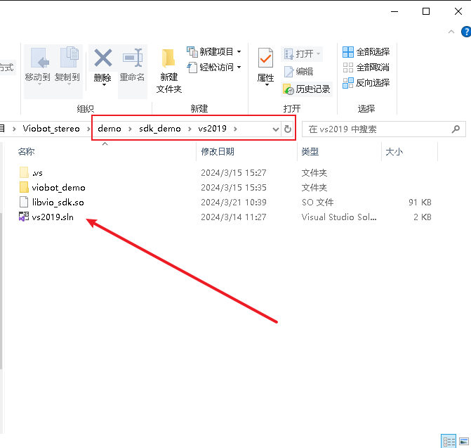
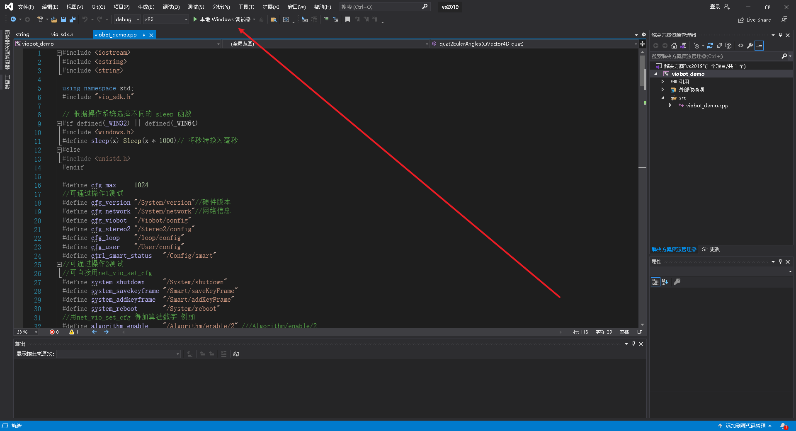
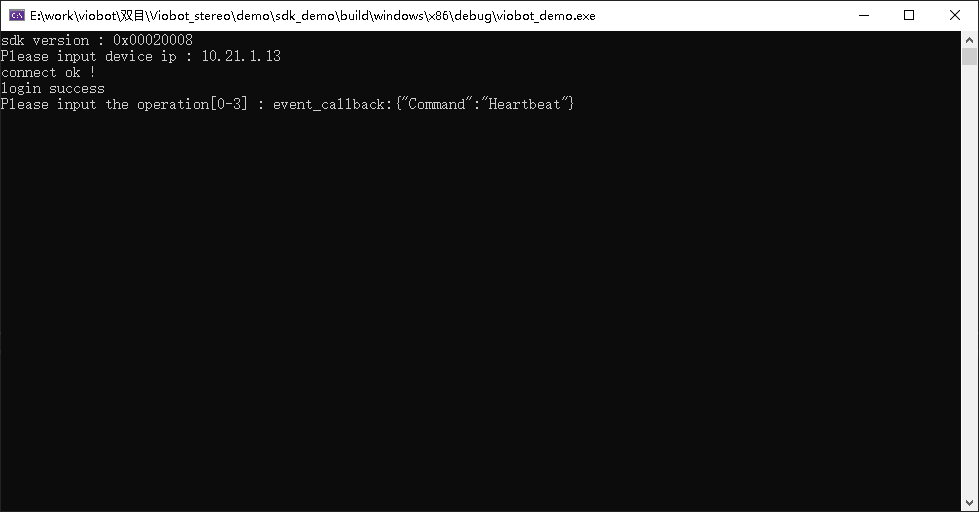
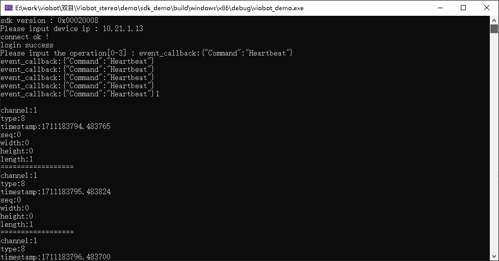
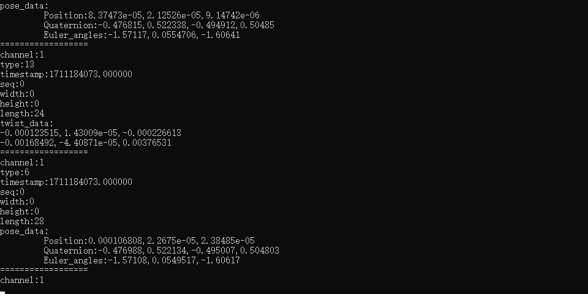
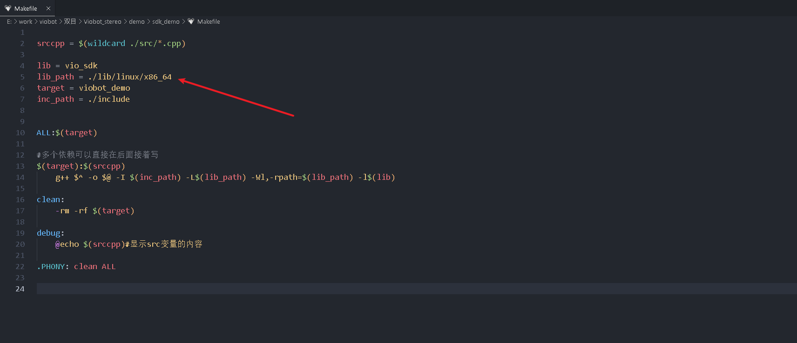
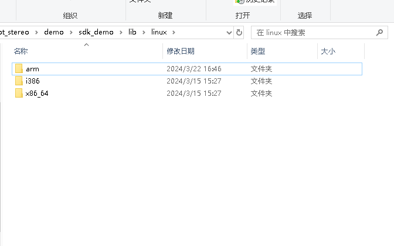
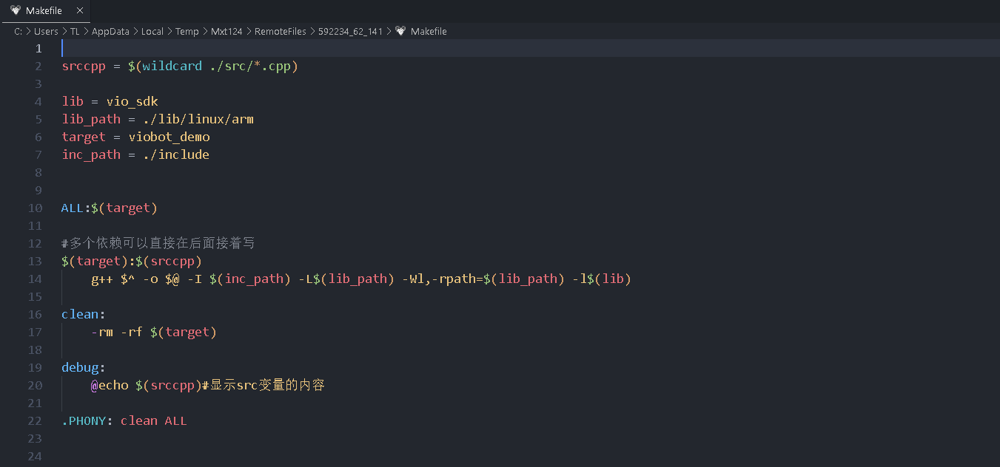
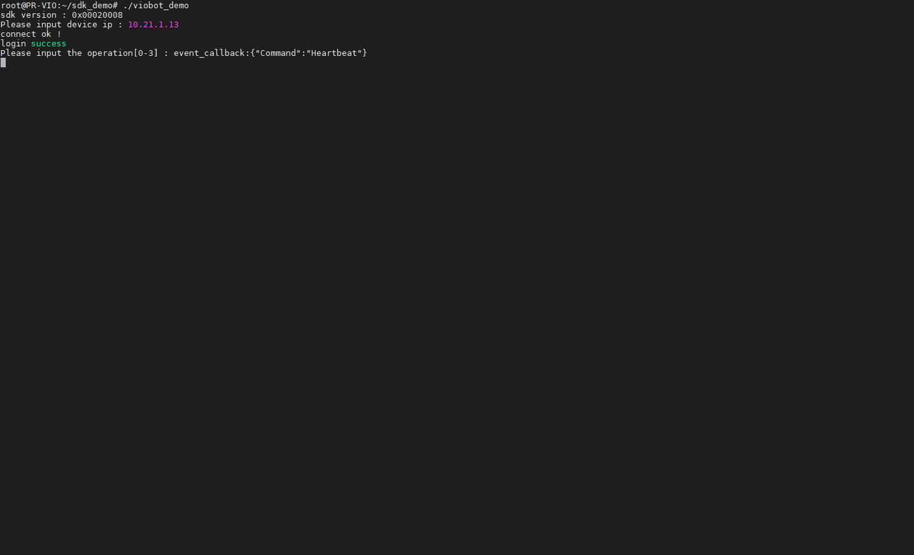
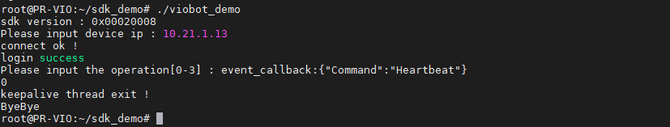

# HTTP Demo

简单说明一下SDK的http使用，给出一个基础的例程。

地址：[Hessian-matrix/SDK\_Demo: http demo (github.com)](https://github.com/Hessian-matrix/SDK_Demo "Hessian-matrix/SDK_Demo: http demo (github.com)")或[SDK\_Demo: http demo (gitee.com)](https://gitee.com/hessian_matrix/SDK_Demo "SDK_Demo: http demo (gitee.com)")

## 1.wimdows下使用

直接使用vs2019打开，直接本地调试器启动就行。





### （1）输入设备IP按回车就能连接上。

会打印event\_callback，表示设备心跳正常。



### （2）输入1按回车，开启流通道1的接收。

通道1的数据就能就收到了，默认会接收到类型8的数据，也就是当前的系统状态，该消息是1秒上传1次。



### （3）输入2按回车，启动/停止stereo2算法

当系统状态是ready时，启动算法，终端会持续打印通道1的pose和twist数据；当系统状态是stereo2\_running时，停止算法，不会再接收到pose和twist数据，也就没有了打印这两个数据。



### （4）输入0按回车，退出登录并停止程序

## 2.linux下使用

### （1）修改makefile里面的lib\_path



lib/linux路径下的对应的so路径对应不同的平台



以viobot本机为例：

改为：`lib_path = ./lib/linux/arm `



### （2）编译运行

```bash
cd sdk_demo
make
./viobot_demo
```



#### 1.输入设备IP按回车就能连接上。

会打印event\_callback，表示设备心跳正常。


#### 2.输入1按回车，开启流通道1的接收。

通道1的数据就能就收到了，默认会接收到类型8的数据，也就是当前的系统状态，该消息是1秒上传1次。


#### 3.输入2按回车，启动/停止stereo2算法

当系统状态是ready时，启动算法，终端会持续打印通道1的pose和twist数据；当系统状态是stereo2\_running时，停止算法，不会再接收到pose和twist数据，也就没有了打印这两个数据。


#### 4.输入0按回车，退出登录并停止程序


