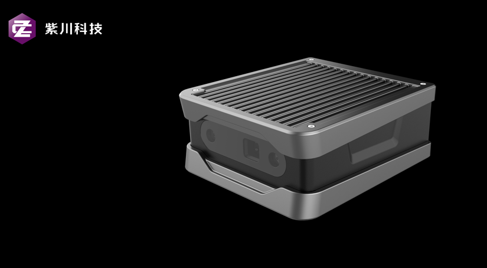
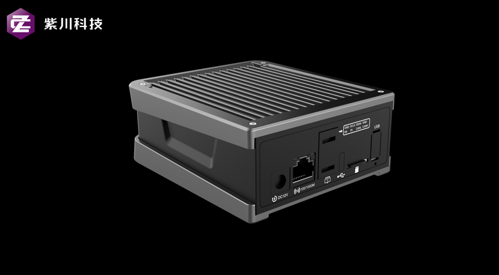
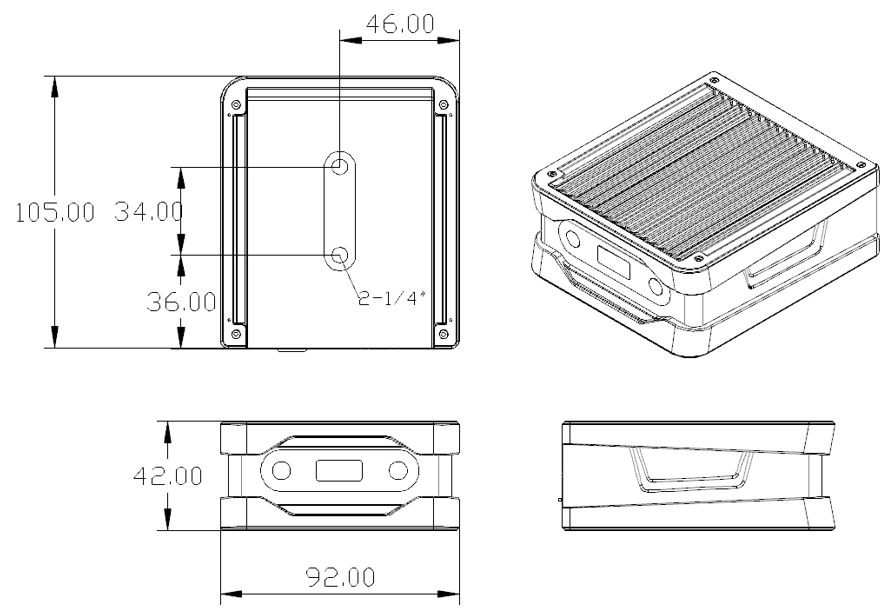

# Viobot简介

Viobot是一款应用于机器人的前端定位模块，通过双目摄像头和自带的imu采集环境以及自身数据，计算并输出设备自身的当前位姿。

Viobot自带的stereo2算法采用双目直接法耦合imu的方式，计算自身位姿并输出半稠密点云。算法还利用了直接法输出的半稠密点云做了处理使之成为更稠密和直观的RDF点云，可用作基础避障。

软件包和demo下载地址：[Hessian-matrix (github.com)](https://github.com/Hessian-matrix "Hessian-matrix (github.com)") 或者[Hessian\_matrix (hessian\_matrix) - Gitee.com](https://gitee.com/hessian_matrix "Hessian_matrix (hessian_matrix) - Gitee.com")

外观总览：

产品尺寸：

