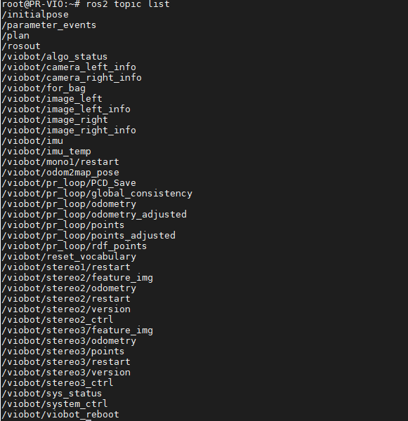

# ROS2版本使用指南

用户名：`PRR`     密码：`PRR`

#### 1.ip和ROS\_DOMAIN\_ID

设备发货的ip都是`192.168.1.100` ROS2多机通信的`ROS_DOMAIN_ID`设置的是218，多台设备同时开机的话需要把IP和`ROS_DOMAIN_ID`改成不一样的，因为如果多台设备的`ROS_DOMAIN_ID`一样的话，会有多个传感器输入，开启算法之后数据输入混乱导致算法混乱。

ip设置可以使用windows上位机，按下图操作即可。

`ROS_DOMAIN_ID`的设置在设备里面`/home/PRR/.bashrc`文件下的最后一行

#### 2.ROS2话题列表

传感器数据：`/imu` `/image_left` `/image_right`

传感器信息数据：

相机内外参： `/camera_left_info` `/camera_right_info`

算法数据输出：

odom：`/pr_loop/odometry`

点云：`/pr_loop/points`  `/pr_loop/points_rdf`

控制算法：

这是自定义数据，在viobot\_interfaces里面可以找到。

stereo2控制：`/stereo2_ctrl`  &#x20;

&#x20;开：enable True

&#x20;关：enable False

&#x20;重启：restart True   （清除词袋，将位姿归零）

&#x20;重置：reset True  (不清除词袋，将位姿归零)

&#x20;    stereo2状态: `/algo_status`

&#x20;    数据主要为string类型，包含了：

"ready"、"stereo2\_initializing"、"stereo2\_running" (还有其他的不用管)

#### 3.坐标系定义

新版本修改为X轴朝前，Y轴朝左，Z轴朝上

#### 4.开机自启动

开机启动脚本位置`/etc/user_setup/start_ros2.sh`
