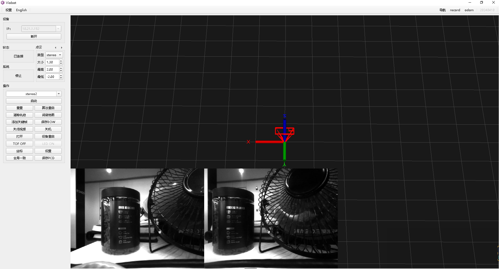
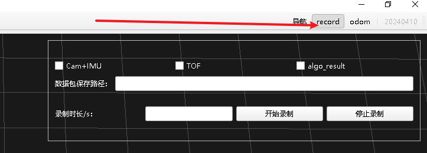
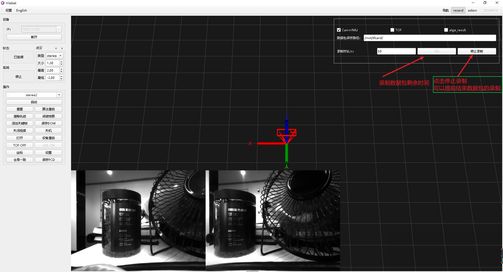
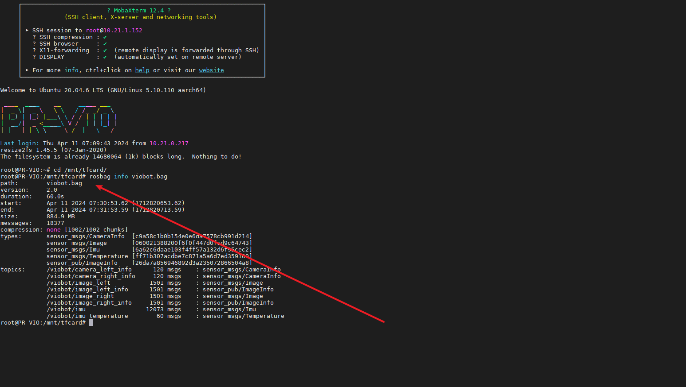

# Viobot数据包录制

录包暂时只支持录制ROS数据包。

需要注意的是，数据包可能会很大，设备自身的存储空间有限，需要外接高速内存卡。

内存卡的写入速度至少在25M/S以上。

## 一.使用UI录制数据包

### 1.连接设备

IP框输入IP，点击连接，连接成功后会直接显示视频流。



### 2.录包



点击右上角record，界面弹出一个小页面，

#### I.勾选需要录制的数据：

（1）Cam+IMU

添加录制左右目相机raw数据、相机内外参、相机曝光参数以及imu原始数据。

（2）TOF

添加录制tof内参数据、深度图以及点云数据。

（3）algo\_result

添加录制算法运行过程的结果数据，包括每帧的odometry、feature\_img 以及点云数据。

#### II.数据包保存路径

输入数据包保存的路径，该路径是在设备上的。由于设备上面的emmc存储空间并不是很大，数据包是raw数据会占用很大的空间。推荐使用高速TF卡，挂载到Viobot，然后把路径指定到挂载的路径里面。挂载TF的具体操作请参考（硬件接口的使用下面的Viobot的TF卡挂载）。

挂载TF卡后输入数据包保存的路径`/mnt/tfcard/`（这里前后斜杠一定要有）

系统默认会做字符串拼接，把输入的`/mnt/tfcard/`加上`viobot.bag`作为包的名称，如果需要录制多个数据包，可在`/mnt/tfcard/`后添加另外的命名标识如：`/mnt/tfcard/20240411_`,它录制出来的数据包就会是`/mnt/tfcard/20240411_viobot.bag`，以此类推。

#### III.输入录制时长，点击开始录制

录制时长单位为秒。点击开始录制的按键，该按键会变成灰色的倒计时，表示录制剩余时间。点击停止录制可提前结束数据包的录制。



#### IIII.录制完成后查看数据包

ssh登录进入设备，用户：PRR      密码：PRR

```bash
cd /mnt/tfcard/
rosbag info viobot.bag
```



可以看到话题列表和对应得帧数以及数据包的大小。

## 二.手动录制数据包

#### 1.用于记录运行过程和现象

这个我们只需要录制开启了stereo2算法后的输出就可以了。

主要需要的话题就是`/viobot/stereo2/feature_img`和 `/viobot/pr_loop/odometry_rect`，这两个话题分别是算法运行过程中提取了特征点并将双目图像合成后的图，可以看到算法在运行过程中的提点表现，其实也是对应上位机视频流输出的视频；另外一个话题是算法运行过程中设备相对于它初始位置的位姿变化，即设备运行过程的位姿，对应上位机上面的相机框的运动。

录包命令：

```bash
rosbag record /viobot/stereo2/feature_img /viobot/pr_loop/odometry_rect -o /mnt/tfcard/run_record.bag
```

其中/mnt/sd\_card/run\_record.bag是所存的数据包的路径+名字，如果不在前面加路径就会录在你当前终端所在的路径，-o会自动给你所取名字增加一个时间在前面，方便区分不同时候录的包。

#### 2.录制运行过程的原始传感器数据

录制了原始的传感器数据，可以通过SDK的for\_bag标志可以关掉设备原本的传感器数据读取，从而将数据包的数据作为算法的输入源来运行算法，可以用于算法的调参。

主要的话题包括`/viobot/image_left `、`/viobot/image_right` 、`/viobot/camera_left_info` 、`/viobot/camera_right_info`、`/viobot/imu`  如果是TOF版本需要开启TOF的话可以加一个话题`/viobot/tof_cloud`

录包命令：

```bash
rosbag record /viobot/image_left /viobot/image_right /viobot/camera_left_info /viobot/camera_right_info /viobot/imu -o /mnt/tfcard/raw_record.bag
```

其中/mnt/sd\_card/raw\_record.bag是所存的数据包的路径+名字，如果不在前面加路径就会录在你当前终端所在的路径，-o会自动给你所取名字增加一个时间在前面，方便区分不同时候录的包。
