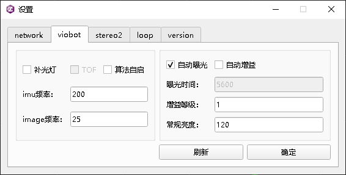

# Viobot算法运行基本参数配置

设备出厂默认设置都是室内的运行参数，基本能够保证在室内场景下运行良好并有一个比较不错的精度表现。一般来说我们修改设置都是修改相机的曝光相关的，以及算法的深度相关参数，建议修改的数据是常规亮度和点云最大深度。

#### 一.室内配置

如果室内场景灯光比较亮，或者是窗户比较多，通光比较好的话，可以将常规亮度设置为90\~95，其他条件下基本设置成下面这样就行。

这里说明一下Z轴修正开关，这是一个Z轴漂移补偿的开关，当运行环境比较平整，没有太大的上下坡度的时候可以开启，开启后算法会将Z轴的漂移量跟xy的平移量做整合，得到一个没有Z轴漂移的位姿。

#### 二.室外配置

室外一般亮度本身会比室内高一些，我们可以把常规亮度设置的相对高一些，可以参考下面的配置

点云最大深度可以看场景的开阔程度，如果30\~50米内基本都有比较高的参照物时，可以设置为100\~150，当场景特别开阔可以设置到200以上。

#### 三.其他场景配置

其他一些场景下还需要用户看一下设备算法的基本运行情况，做出相应的修改，如果是亮度特别低的场景，建议开启补光灯或者自己增加一个补光灯设备，使得设备有一个比较清晰的成像。
