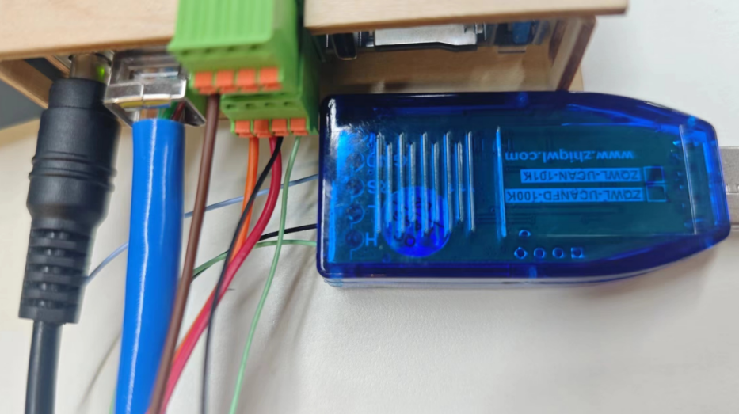
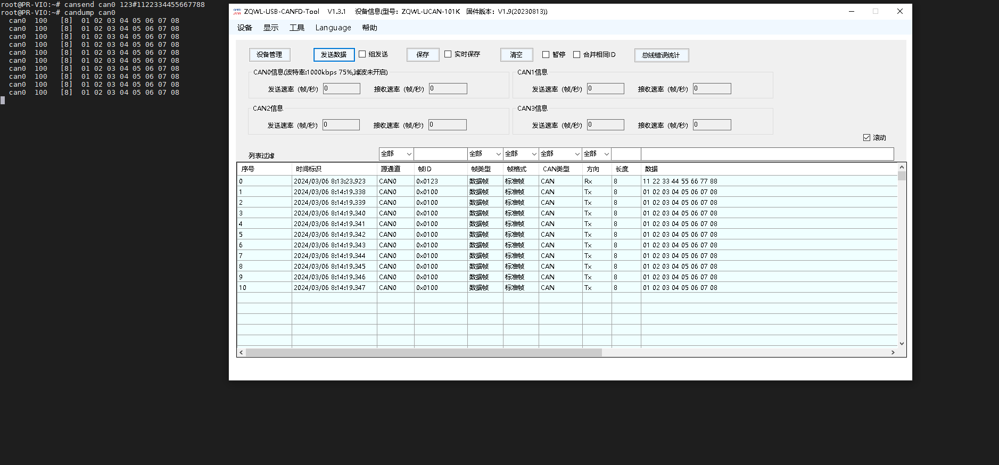
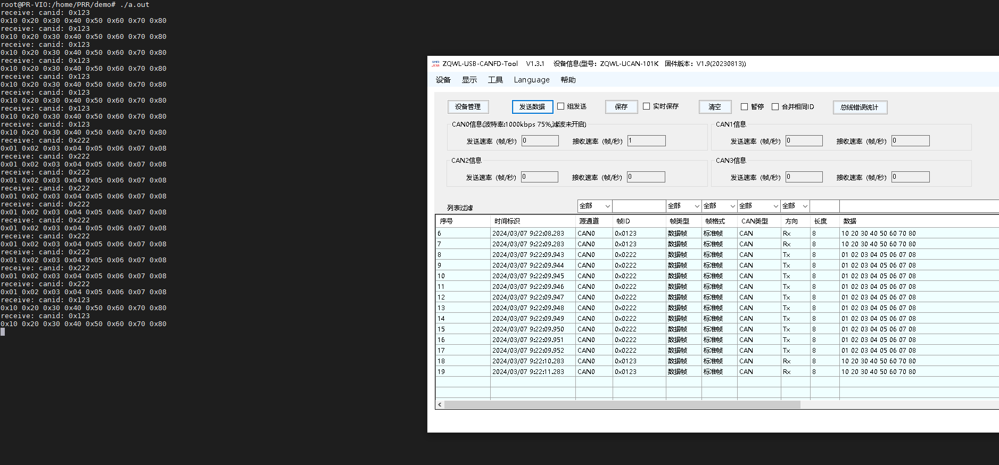

# Viobot的CAN使用

下面我们来介绍Viobot的CAN口使用


### 1.接口定义

Viobot面有一个2\*4pin的接口母座，接头我们发货的时候会放在盒子里面的。

我们可以看到第一排从左到右引脚分别是GND SCL SDA GND

第二排从左到右分别是RX TX CANL CANH

对应的设备号：CAN0

### 2.硬件连接

此处使用Viobot与windows电脑的CAN转USB模块通信作为例子。

我们可以先去某宝上买一个带上位机的CAN转USB模块，将Viobot的CANL和CANH接到模块的CANL和CANH上面，然后将模块插到电脑。



### 3.命令行测试

```bash
sudo apt install can-utils
ifconfig can0 down
ip link set can0 type can bitrate 1000000
ifconfig can0 up
#发送数据
cansend can0 123#1122334455667788
#接收can总线上的数据
candump can0

```



### 4.代码

测试完成后，开始进入编程环节。

我们这里使用的是socket\_can,程序里面没有使用任何ROS相关的操作，所以跟ROS/ROS2无关，程序都是通用的。

#### （1）can\_demo.cpp

两个线程，主线程1秒发送一帧数，另外一个线程一直接收数据，把总线上接收到的数据打印出来。

```c++
#include <thread>
#include <iostream>
#include "socket_can.hpp"
Socket_Can socket_can;

void can_receive_thread(){
    struct can_frame rec_frame;
    while(1){
        int ret = socket_can.receive_can_frame(rec_frame);
        // printf("ret = %d\r\n",ret);
        std::cout << "receive: canid: 0x" << std::hex << rec_frame.can_id << std::endl;
        for(int i = 0; i < rec_frame.can_dlc; i++){
            printf("0x%02x ",rec_frame.data[i]);
        }
        std::cout << std::endl;
    }
}

int main(int argc,char **argv){
    try{
        socket_can.can_init();
    }
    catch(const std::runtime_error& e){
        socket_can.close_socket();
    }

    std::thread can_recieve = std::thread(can_receive_thread);
    struct can_frame my_frame;
    /*TEST*/
    my_frame.can_id = 0x123;
    my_frame.can_dlc = 8;
    my_frame.data[0]= 0x10;
    my_frame.data[1]= 0x20;
    my_frame.data[2]= 0x30;
    my_frame.data[3]= 0x40;

    my_frame.data[4]= 0x50;
    my_frame.data[5]= 0x60;
    my_frame.data[6]= 0x70;
    my_frame.data[7]= 0x80;

    while(1){
        try{
            socket_can.send_can_frame(my_frame);
        }catch(const std::runtime_error& e){
            socket_can.close_socket();
        }
        sleep(1);
    }
}

```

#### （2）Socket\_can.hpp

简单封装的一个can口类，包含了初始化，发送和接收三个最基本的。

```c++
#pragma once
#include <cstdio>
#include <cstdlib>
#include <cstring>
#include <iostream>
#include <stdexcept>
#include <sstream>  

#include <unistd.h> 
#include <sys/ioctl.h>
#include <sys/socket.h>
#include <linux/can.h>
#include <linux/can/raw.h>
#include <net/if.h>
#include <termios.h>

/* special address description flags for the CAN_ID */
#define CAN_EFF_FLAG 0x80000000U /* 扩展帧的标识 */
#define CAN_RTR_FLAG 0x40000000U /* 远程帧的标识 */
#define CAN_ERR_FLAG 0x20000000U /* 错误帧的标识，用于错误检查 */
/* mask */
#define CAN_SFF_MASK 0x000007FFU /* <can_id & CAN_SFF_MASK>获取标准帧 ID */
#define CAN_EFF_MASK 0x1FFFFFFFU /* <can_id & CAN_EFF_MASK>获取标准帧 ID */
#define CAN_ERR_MASK 0x1FFFFFFFU /* omit EFF, RTR, ERR flags */

/*
struct can_frame {
 canid_t can_id;  // CAN 标识符 
 __u8 can_dlc;    // 数据长度（最长为 8 个字节） 
 __u8 __pad;      // padding 
 __u8 __res0;     // reserved / padding 
 __u8 __res1;     // reserved / padding 
 __u8 data[8];    // 数据 
 };  
*/ 

class Socket_Can{
public:
    Socket_Can(){
        
    }
    ~Socket_Can(){ close(socket_fd); }

    void can_init(){
        /*打开套接字*/
        socket_fd = socket(PF_CAN,SOCK_RAW, CAN_RAW);
        if(0 > socket_fd){
            throw std::runtime_error("socket error!");//std::system_error

        }
        system("ifconfig can0 down");
        system("/sbin/ip link set can0 type can bitrate 1000000");
        // system("/sbin/ip link set can0 type can loopback on");
        // system("/sbin/ip link set can0 type can loopback off");
        system("ifconfig can0 up");

        /*指定CAN设备*/
        strcpy(ifr.ifr_name,"can0");
        ret = ioctl(socket_fd,SIOCGIFINDEX, &ifr);
        can_addr.can_family = AF_CAN;  /*填充数据*/
        can_addr.can_ifindex = ifr.ifr_ifindex;
        if(ret < 0){
            std::stringstream ss;
            ss << "Failed to get index for " << "can0" << " device";
            throw std::runtime_error(ss.str());   
        }
        /* 将can0与套接字进行绑定 */
        ret = bind(socket_fd, (struct sockaddr *)&can_addr, sizeof(can_addr));
        if(ret < 0){
            throw std::runtime_error("bind error!");        
        }

        // ifr.ifr_flags &= ~IFF_UP; // 
        // ret = ioctl(socket_fd, SIOCSIFFLAGS, &ifr);

        // ifr.ifr_flags |= IFF_UP; // 开启接口
        // ret = ioctl(socket_fd, SIOCSIFFLAGS, &ifr);
        // if(ret < 0)
        // {
        //     throw std::runtime_error("Error bringing up CAN interface");         
        // }

        // setsockopt(socket_fd, SOL_CAN_RAW, CAN_RAW_FILTER, NULL, 0);/* 设置过滤规则：不接受任何报文、仅发送数据 */
        // rfilter[0].can_id = 0x60A;
        // rfilter[0].can_mask = CAN_SFF_MASK;
        // rfilter[1].can_id = 0x60B;
        // rfilter[1].can_mask = 0x7FF;
        // // 调用 setsockopt 设置过滤规则
        setsockopt(socket_fd, SOL_CAN_RAW, CAN_RAW_FILTER, &rfilter, sizeof(rfilter));
    }

    void send_can_frame(const struct can_frame& xframe){
        ret = write(socket_fd,&xframe,sizeof(xframe));
        if(ret != sizeof(xframe)){
                throw std::runtime_error("CAN_Send error!"); 
        }
    }

    int receive_can_frame(struct can_frame& xframe){
        ret = read(socket_fd,&xframe,sizeof(xframe));
        // if(ret != sizeof(xframe))
        // {
        //     throw std::runtime_error("CAN_Read error!"); 
        // }
        return ret;
    }

    void close_socket(){
        close(socket_fd);// 关闭套接字
    }

private:
    struct ifreq ifr = {0};
    struct sockaddr_can can_addr = {0};
    int socket_fd = -1;
    int ret;
    struct can_filter rfilter[2];
};

```

#### （3）编译运行

将上面的hpp文件和cpp文件单独放到一个文件夹里面，直接g++编译即可

```c++
g++ can_dmo.cpp -lpthread 
./a.out
```

效果：

每秒向can总线发送一帧数据，接收到can总线的数据会打印到终端


