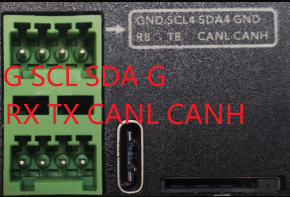

# Viobot的I2C使用

下面我们来介绍Viobot的CAN口使用



### 1.接口定义

Viobot面有一个2\*4pin的接口母座，接头我们发货的时候会放在盒子里面的。

我们可以看到第一排从左到右引脚分别是GND SCL SDA GND

第二排从左到右分别是RX TX CANL CANH

对应的设备号：IIC6

### 2.硬件连接

我们以MPU9250的模块来做例子，由此也可以推到其他的iic设备。

给模块供电后直接把Viobot和MPU9250的SCL、SDA分别对接起来。

### 3.程序编译测试

linux有自带的linux-I2C可以直接读写iic设备。

因为使用的是mpu9250，所以程序里面的寄存器都是针对9250的。

程序由三个文件组成，其实主要就是\<linux/i2c.h>和\<linux/i2c-dev.h>里面的write函数和read函数的简单使用。

#### （1）mpu9250.h

里面定义了mpu9250的一些寄存器地址，以及声明了mpu9250的类：

```c++
#ifndef _MPU9250_H
#define _MPU9250_H
/*C*/
#include <stdio.h>
#include <errno.h>
#include <stdlib.h>
/*C++*/
#include <cstdio>
#include <cstdlib>
#include <sstream>  
#include <cstring>
#include <iostream>
#include <stdexcept>
/*other*/
#include <fcntl.h>
#include <unistd.h> 
#include <termios.h>
#include <sys/stat.h> 
#include <sys/ioctl.h> 
#include <sys/types.h> 
/*I2C*/
#include <linux/i2c.h>
#include <linux/i2c-dev.h>

#define I2C_DEV "/dev/i2c-6"
#define Device_Address 0x68
// #define Device_Address 0x69

//MPU6500的内部寄存器
#define MPU_SELF_TESTX_REG    0X0D  //自检寄存器X
#define MPU_SELF_TESTY_REG    0X0E  //自检寄存器Y
#define MPU_SELF_TESTZ_REG    0X0F  //自检寄存器Z
#define MPU_SELF_TESTA_REG    0X10  //自检寄存器A
#define MPU_SAMPLE_RATE_REG    0X19  //采样频率分频器
#define MPU_CFG_REG        0X1A  //配置寄存器
#define MPU_GYRO_CFG_REG    0X1B  //陀螺仪配置寄存器
#define MPU_ACCEL_CFG_REG    0X1C  //加速度计配置寄存器
#define MPU_MOTION_DET_REG    0X1F  //运动检测阀值设置寄存器
#define MPU_FIFO_EN_REG      0X23  //FIFO使能寄存器
#define MPU_I2CMST_CTRL_REG    0X24  //IIC主机控制寄存器
#define MPU_I2CSLV0_ADDR_REG  0X25  //IIC从机0器件地址寄存器
#define MPU_I2CSLV0_REG      0X26  //IIC从机0数据地址寄存器
#define MPU_I2CSLV0_CTRL_REG  0X27  //IIC从机0控制寄存器
#define MPU_I2CSLV1_ADDR_REG  0X28  //IIC从机1器件地址寄存器
#define MPU_I2CSLV1_REG      0X29  //IIC从机1数据地址寄存器
#define MPU_I2CSLV1_CTRL_REG  0X2A  //IIC从机1控制寄存器
#define MPU_I2CSLV2_ADDR_REG  0X2B  //IIC从机2器件地址寄存器
#define MPU_I2CSLV2_REG      0X2C  //IIC从机2数据地址寄存器
#define MPU_I2CSLV2_CTRL_REG  0X2D  //IIC从机2控制寄存器
#define MPU_I2CSLV3_ADDR_REG  0X2E  //IIC从机3器件地址寄存器
#define MPU_I2CSLV3_REG      0X2F  //IIC从机3数据地址寄存器
#define MPU_I2CSLV3_CTRL_REG  0X30  //IIC从机3控制寄存器
#define MPU_I2CSLV4_ADDR_REG  0X31  //IIC从机4器件地址寄存器
#define MPU_I2CSLV4_REG      0X32  //IIC从机4数据地址寄存器
#define MPU_I2CSLV4_DO_REG    0X33  //IIC从机4写数据寄存器
#define MPU_I2CSLV4_CTRL_REG  0X34  //IIC从机4控制寄存器
#define MPU_I2CSLV4_DI_REG    0X35  //IIC从机4读数据寄存器

#define MPU_I2CMST_STA_REG    0X36  //IIC主机状态寄存器
#define MPU_INTBP_CFG_REG    0X37  //中断/旁路设置寄存器
#define MPU_INT_EN_REG      0X38  //中断使能寄存器
#define MPU_INT_STA_REG      0X3A  //中断状态寄存器

#define MPU_ACCEL_XOUTH_REG    0X3B  //加速度值,X轴高8位寄存器
#define MPU_ACCEL_XOUTL_REG    0X3C  //加速度值,X轴低8位寄存器
#define MPU_ACCEL_YOUTH_REG    0X3D  //加速度值,Y轴高8位寄存器
#define MPU_ACCEL_YOUTL_REG    0X3E  //加速度值,Y轴低8位寄存器
#define MPU_ACCEL_ZOUTH_REG    0X3F  //加速度值,Z轴高8位寄存器
#define MPU_ACCEL_ZOUTL_REG    0X40  //加速度值,Z轴低8位寄存器

#define MPU_TEMP_OUTH_REG    0X41  //温度值高八位寄存器
#define MPU_TEMP_OUTL_REG    0X42  //温度值低8位寄存器

#define MPU_GYRO_XOUTH_REG    0X43  //陀螺仪值,X轴高8位寄存器
#define MPU_GYRO_XOUTL_REG    0X44  //陀螺仪值,X轴低8位寄存器
#define MPU_GYRO_YOUTH_REG    0X45  //陀螺仪值,Y轴高8位寄存器
#define MPU_GYRO_YOUTL_REG    0X46  //陀螺仪值,Y轴低8位寄存器
#define MPU_GYRO_ZOUTH_REG    0X47  //陀螺仪值,Z轴高8位寄存器
#define MPU_GYRO_ZOUTL_REG    0X48  //陀螺仪值,Z轴低8位寄存器

#define MPU_I2CSLV0_DO_REG    0X63  //IIC从机0数据寄存器
#define MPU_I2CSLV1_DO_REG    0X64  //IIC从机1数据寄存器
#define MPU_I2CSLV2_DO_REG    0X65  //IIC从机2数据寄存器
#define MPU_I2CSLV3_DO_REG    0X66  //IIC从机3数据寄存器

#define MPU_I2CMST_DELAY_REG  0X67  //IIC主机延时管理寄存器
#define MPU_SIGPATH_RST_REG    0X68  //信号通道复位寄存器
#define MPU_MDETECT_CTRL_REG  0X69  //运动检测控制寄存器
#define MPU_USER_CTRL_REG    0X6A  //用户控制寄存器
#define MPU_PWR_MGMT1_REG    0X6B  //电源管理寄存器1
#define MPU_PWR_MGMT2_REG    0X6C  //电源管理寄存器2 
#define MPU_FIFO_CNTH_REG    0X72  //FIFO计数寄存器高八位
#define MPU_FIFO_CNTL_REG    0X73  //FIFO计数寄存器低八位
#define MPU_FIFO_RW_REG      0X74  //FIFO读写寄存器
#define MPU_DEVICE_ID_REG    0X75  //器件ID寄存器

//定义数字低通滤波器阈值
#define MPU9250_DLPF_BW_256      0x00
#define MPU9250_DLPF_BW_188      0x01
#define MPU9250_DLPF_BW_98      0x02
#define MPU9250_DLPF_BW_42      0x03
#define MPU9250_DLPF_BW_20      0x04
#define MPU9250_DLPF_BW_10      0x05
#define MPU9250_DLPF_BW_5      0x06

#define gravity 9.8

class MPU9250{
public:
    MPU9250();
    ~MPU9250();

    void Init();
    void getAccelGyroData(int16_t *AccelGyroData);
    void MPU9250_Temp_Read(int16_t *TempData);
    // void MPU9250_Set_ZeroBias();
private:
    int fd;
};

#endif

```

#### （2）mpu9250.cpp

mpu9250的类实现，包含了初始化mpu9250、读取加速度和角速度原始数据，以及读取温度数据几个方法：

```c++
#include "MPU9250_demo/mpu9250.h"
// #include "mpu9250.h"

MPU9250::MPU9250(){
    fd = open(I2C_DEV,O_RDWR);
    if(fd < 0){
        // printf("open %s failed\n",I2C_DEV);
        std::stringstream ss;
        ss << "Failed to open " << I2C_DEV << " device";
        throw std::runtime_error(ss.str());
    }
    int ret = ioctl(fd,I2C_SLAVE,Device_Address);
    if(ret < 0){
        // printf("setenv address faile ret: %x \n", ret);
        throw std::runtime_error("Failed to set I2C address");  
    }
}

MPU9250::~MPU9250(){
    close(fd);
}

void MPU9250::Init(){
    char buf[2];

    //复位MPU9250
    buf[0] = MPU_PWR_MGMT1_REG;
    buf[1] = 0x80;
    write(fd,buf,2);

    //唤醒MPU9250，并选择陀螺仪x轴PLL为时钟源 (MPU9250_RA_PWR_MGMT_1, 0x01)
    usleep(100 * 1000);
    buf[0] = MPU_PWR_MGMT1_REG;
    buf[1] = 0x00;
    write(fd,buf,2);

    //禁止中断
    usleep(100 * 1000);
    buf[0] = MPU_INT_EN_REG;
    buf[1] = 0x18;
    write(fd, buf, 2);
    
    //陀螺仪满量程+-250度/秒 (最低分辨率 = 2^15/250 = 131.072LSB/度/秒
    usleep(100 * 1000);
    buf[0] = MPU_GYRO_CFG_REG;
    buf[1] = 0x00;
    write(fd, buf, 2);

    //加速度满量程+-4g   (最低分辨率 = 2^15/4g = 8192/g )
    usleep(100 * 1000);
    buf[0] = MPU_ACCEL_CFG_REG;
    buf[1] = 0x08;
    write(fd, buf, 2);

    //设置陀螺的输出为1kHZ,DLPF=20Hz
    usleep(100 * 1000);
    buf[0] = MPU_CFG_REG;
    buf[1] = MPU9250_DLPF_BW_20;
    write(fd, buf, 2);

    //采样分频 (采样频率 = 陀螺仪输出频率 / (1+DIV)，采样频率1000hz）
    usleep(100 * 1000);
    buf[0] = MPU_SAMPLE_RATE_REG;
    buf[1] = 0x00;
    write(fd, buf, 2);

    // MPU 可直接访问MPU9250辅助I2C
    usleep(100 * 1000);
    buf[0] = MPU_INTBP_CFG_REG;
    buf[1] = 0x82;
    write(fd, buf, 2);
}

/*--------------TEST-------------*/
    // addr[0] = MPU_DEVICE_ID_REG;
    // write(fd,addr,1);
    // read(fd,buf,1);
    // printf("%x\r\n",buf[0]);
void MPU9250::getAccelGyroData(int16_t *AccelGyroData){
    char addr[1];
    char buf[6];

    addr[0] = MPU_ACCEL_XOUTH_REG;
    write(fd,addr,1);
    read(fd,buf,6);

    AccelGyroData[0] = (int16_t)((buf[0]<<8)|buf[1]);
    AccelGyroData[1] = (int16_t)((buf[2]<<8)|buf[3]);
    AccelGyroData[2] = (int16_t)((buf[4]<<8)|buf[5]);

    addr[0] = MPU_GYRO_XOUTH_REG;
    write(fd,addr,1);
    read(fd,buf,6);

    AccelGyroData[3] = (int16_t)((buf[0]<<8)|buf[1]);
    AccelGyroData[4] = (int16_t)((buf[2]<<8)|buf[3]);
    AccelGyroData[5] = (int16_t)((buf[4]<<8)|buf[5]);
}

void MPU9250::MPU9250_Temp_Read(int16_t *TempData){
    char addr[1];
    char buf[6];
    short data;

    addr[0] = MPU_TEMP_OUTH_REG;
    write(fd,addr,1);
    read(fd,buf,6);   
    data = (int16_t)((buf[0] << 8) | buf[1]);
   *TempData = 21.0 + ((float)data / 333.87f);        
}

```

#### （3）mpu9250\_node.cpp

这里加了imu数据转化和话题发送，如果是ROS2可自行把话题发送改成ROS的，不使用ROS直接打印也可以。

```c++
#include <ros/ros.h>
#include <sensor_msgs/Imu.h>
#include <serial/serial.h>
#include <std_msgs/String.h>
#include <iostream>
#include <string>
#include <sstream>
#include "MPU9250_demo/mpu9250.h"

int main(int argc,char **argv){
    int16_t accelgyrodata[6] = {0};

    MPU9250 mpu9250;
    ros::init(argc,argv,"MPU9250_demo");
    ros::NodeHandle nh;
    mpu9250.Init();//1khz输出频率

    ros::Publisher imu_pub = nh.advertise<sensor_msgs::Imu>("imu",10);   

    sensor_msgs::Imu imu_msg;

    ros::Rate loop_rate(1000);
    while(ros::ok()){
        mpu9250.getAccelGyroData(accelgyrodata);

        imu_msg.header.stamp = ros::Time::now();
        imu_msg.header.frame_id = "Imu_frame";

        imu_msg.angular_velocity.x = accelgyrodata[3] / 131.072;
        imu_msg.angular_velocity.y = accelgyrodata[4] / 131.072;
        imu_msg.angular_velocity.z = accelgyrodata[5] / 131.072;

        imu_msg.linear_acceleration.x = accelgyrodata[0] / 8192.0 * gravity;
        imu_msg.linear_acceleration.y = accelgyrodata[1] / 8192.0 * gravity;
        imu_msg.linear_acceleration.z = accelgyrodata[2] / 8192.0 * gravity;

        printf("imu_msg.linear_acceleration.x = %lf\n",imu_msg.linear_acceleration.x);
        printf("imu_msg.linear_acceleration.y = %lf\n",imu_msg.linear_acceleration.y);
        printf("imu_msg.linear_acceleration.z = %lf\n",imu_msg.linear_acceleration.z);
        printf("imu_msg.angular_velocity.x = %lf\n",imu_msg.angular_velocity.x);
        printf("imu_msg.angular_velocity.y = %lf\n",imu_msg.angular_velocity.y);
        printf("imu_msg.angular_velocity.z = %lf\n",imu_msg.angular_velocity.z);

        imu_pub.publish(imu_msg);
        loop_rate.sleep();
    }
}

```

#### （4）效果展示

这个代码效果就是不断的读取mpu9250的数据并打印到终端


