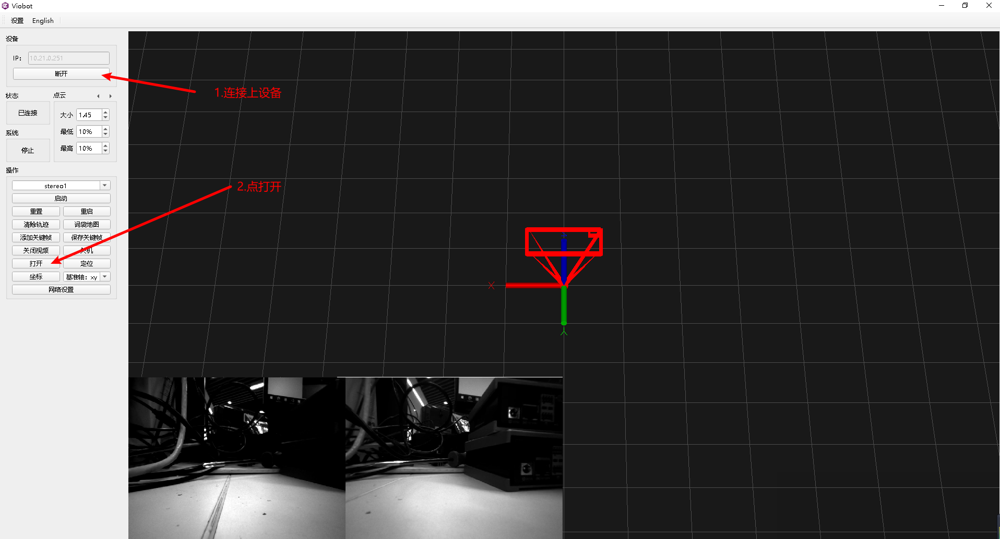

# 网卡挂载与连接wifi

### 1.把驱动文件放到设备里面



打开了一个网络文件夹，用户：root 密码：PRR


查看samba文件夹里面是否有module文件夹，如果没有则新建


把8188eu.ko文件拉到module文件夹下（pro版对应文件是pro-8188eu.ko）


### 2.网卡挂载

挂载网卡：

ssh进到设备里面，用户：PRR 密码：PRR

基础版：

```bash
sudo insmod /home/PRR/Viobot/module/8188eu.ko    #基础版
```

pro版：

```bash
sudo insmod /home/PRR/Viobot/module/pro-8188eu.ko #pro版
```

### 3.连接wifi

#### 1）查看设备状态

```bash
nmcli device
```


这里的网卡名称为`wlx70f11c4b16f7`

#### 2）搜索wifi

```bash
nmcli device wifi list #会出来可见的WIFI列表
```


#### 3）连接无线热点

```bash
 sudo nmcli device wifi connect "PRROBOT" password "12345678" #PRROBOT对应你的SSID,12345678对应你的密码
```

#### 4）查看连接状态

```bash
nmcli connection show
```


#### 5）查看当前网络IP

输入`ifconfig`查看当前连接的ip


用自己的电脑ping一下wifi的ip测试是否能用，需注意网段。

#### 6）其他

这个方式直接连接wifi的IP是自动分配的，如果需要设置静态IP：

```bash
sudo nmcli connection modify PRROBOT ipv4.addresses '10.21.10.16/24' ipv4.gateway '10.21.10.1' ipv4.dns '8.8.8.8' ipv4.method manual
```

`PRROBOT`对应`nmcli connection show`显示的`name`，ip : `10.21.10.16` ，掩码需要换算一下：`255.255.255.0`对应`24` ，网关：`10.21.10.1`，DNS：`8.8.8.8`  注意：静态IP需要保证你设置的IP不会与别的设备冲突。

如果要重新设置为自动获取IP：

```bash
sudo nmcli connection modify PRROBOT  ipv4.method auto 
```

设置完之后需要重新连接一下：

```bash
sudo nmcli connection up PRROBOT  
```

再重新用ifconfig查看ip即可

### 4.设置开机自动连接wifi

创建一个 systemd service 文件：

`sudo vim /etc/systemd/system/wifi-startup.service`

将下面的内容写入文件里面：

```bash
[Unit]
Description=Start wifi
After=network.target NetworkManager.service
Requires=NetworkManager.service

[Service]
Type=simple
User=root
Group=root
ExecStart = insmod /home/PRR/Viobot/module/8188eu.ko

[Install]
WantedBy = multi-user.target
```

&#x20; pro版本将`ExecStart = insmod /home/PRR/Viobot/module/pro-8188eu.ko` 替换为 ` ExecStart = insmod /home/PRR/Viobot/module/8188eu.ko`

使 systemd 开始管理这个新 service：

```bash
sudo systemctl enable wifi-startup.service
```

重启设备即可
